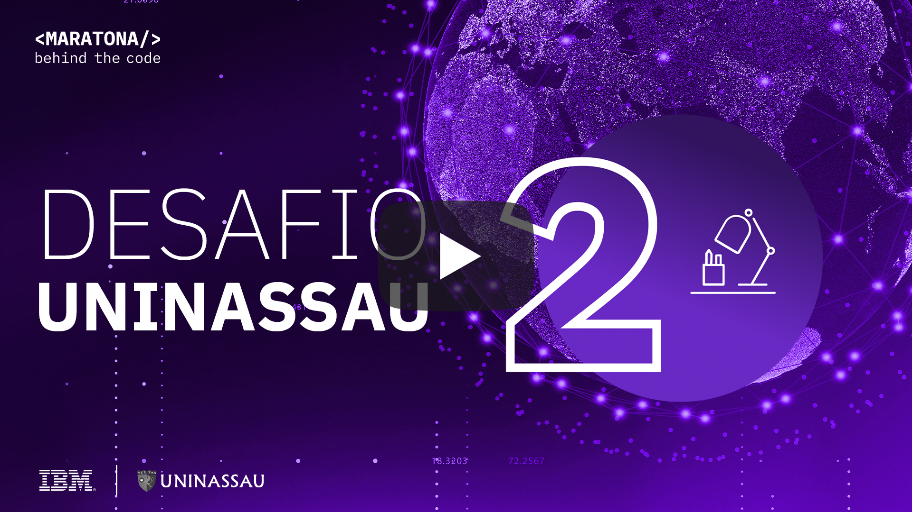
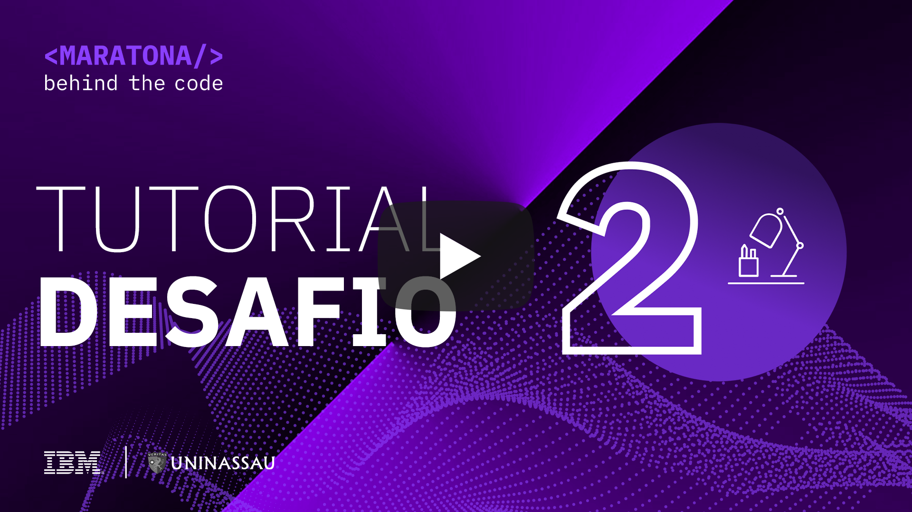
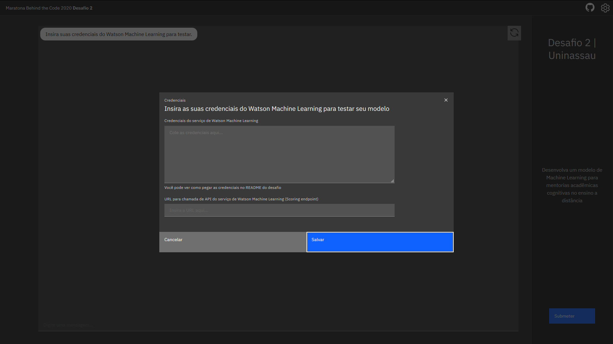
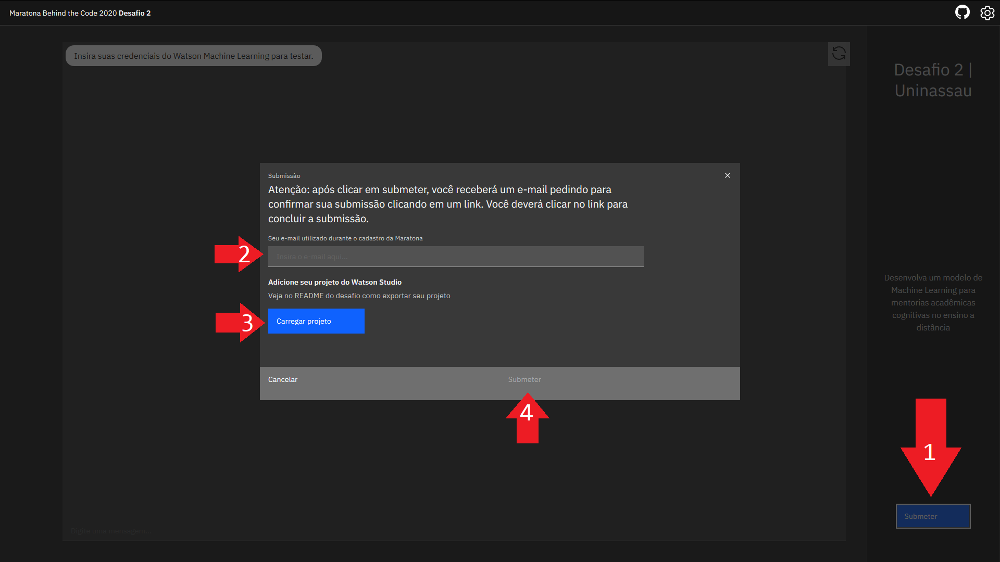

# Desafio 02 | UNINASSAU

- [1. Sobre a UNINASSAU](#1-sobre-a-uninassau)
  - [1.1. Introdução](#11-introdução)
  - [1.2. Premiação](#12-premiação)
- [2. Desafio de negócio](#2-desafio-de-negocio)
- [3. Objetivo](#3-objetivo)
- [4. Desenvolvendo a Solução](#4-desenvolvendo-a-solucao)
  - [4.1. Pré-requisitos](#41-pré-requisitos)
  - [4.2. Resumo das tarefas](#42-resumo-das-tarefas)
  - [4.3. Desenvolvimento](#43-desenvolvimento)
- [5. Submissão](#5-submissão)
- [6. Sobre a avaliação](#6-sobre-a-avaliação)

## Para te ajudar

- [Material de Apoio](#material-de-apoio)
- [Em caso de dúvidas](#em-caso-de-duvidas)
- [License](#license)

## 1. Sobre a UNINASSAU

### 1.1. Introdução

Fundado em 2003 e com sede no Recife, o Grupo Ser Educacional (B3 SEER3) é um dos maiores grupos privados de educação do Brasil e líder nas regiões Nordeste e Norte em alunos matriculados. A Companhia oferece cursos de graduação, pós-graduação, técnicos e ensino a distância e está presente em 26 estados e no Distrito Federal, em uma base consolidada de aproximadamente 185 mil alunos. A Companhia opera sob as marcas UNINASSAU, UNINASSAU – Centro Universitário Maurício de Nassau, UNINABUCO - Centro Universitário Joaquim Nabuco, Faculdades UNINABUCO, Escolas Técnicas Joaquim Nabuco e Maurício de Nassau, UNIVERITAS/UNG, UNAMA – Universidade da Amazônia e Faculdade da Amazônia e UNIVERITAS – Centro Universitário Universus Veritas, Faculdades UNIVERITAS e a UNINORTE – Centro Universitário do Norte, por meio das quais oferece 1.904 cursos. A UNINASSAU, uma instituição do Grupo Ser Educacional, tem foco na inovação e na trabalhabilidade, oferta aos seus alunos uma formação integral e transformadora. A UNINASSAU prepara profissionais para atuar no ambiente competitivo e dinâmico do mercado de trabalho, empenhados na Responsabilidade Socioambiental, fazendo escolhas, buscando alternativas e valorizando suas competências para criar novas oportunidades. Preocupa-se, acima de tudo, com o ser humano e com sua realização pessoal e profissional.

    

### 1.2. Premiação

 - O primeiro e segundo colocado neste desafio serão premiados com bolsas integrais de bacharelado da UNINASSAU na modalidade EAD!

- Os dez melhores colocados no ranking final da Maratona no Brasil serão premiados com bolsas de estudo integrais na modalidade EAD na UNINASSAU, nos seguintes cursos: *Coding*, *Data Science*, *Digital Security* e *Game Design*.

## 2. Desafio de negócio

O ensino a distância (EaD) proporciona diversas novas possibilidades. Atualmente centenas de estudantes têm acesso aos mesmos conteúdos, participam das mesmas aulas e têm os mesmos professores, tudo de forma remota. Uma das grandes vantagens do EaD é a flexibilidade para que estudantes de todo o país possam trabalhar e estudar ao mesmo tempo. Entretanto, a boa e velha interação interpessoal nem sempre é possível, seja por baixa oferta de horários disponíveis para professores e tutores, ou choques de horários com trabalho e outras obrigações dos estudantes.

Atualmente é possível a realização de uma tutoria remota automática com o auxílio de assistentes virtuais. Esses assistentes podem ser integrados com modelos avançados de aprendizado de máquina, que são alimentados com dados sobre o estudante e seu desempenho nas diferentes disciplinas de seu curso. Esses modelos, por sua vez, podem ser capazes de identificar áreas ou competências específicas em que o estudante tenha certa dificuldade e recomendar conteúdo personalizado para cada aluno, de forma completamente escalável e com atendimento 24/7.

## 3. Objetivo

Neste desafio, o participante irá utilizar ferramentas da IBM como o *Watson Machine Learning* e o *Cloud Pak for Data* para construir um modelo baseado em *machine learning* e integrá-lo com uma solução de assistente virtual, voltada para a tutoria remota. Sua tarefa será aprimorar um modelo já fornecido e integrar os diversos serviços envolvidos nessa solução!

## 4. Desenvolvendo a solução

### 4.1. Pré-requisitos

Para realizar esse desafio você deverá cumprir os seguintes pré-requisitos:

- Registrar-se na [Maratona Behind the Code](https://ibm.biz/maratona) e confirmar seu e-mail de cadastro.
- Possuir uma conta na [IBM Cloud](https://ibm.biz/registro-maratona), podendo ser a conta FREE ou pay-as-you-go (não é necessário registrar-se no evento com o mesmo e-mail utilizado para criar sua conta na IBM Cloud).

### 4.2. Resumo das tarefas

1. Instanciar o Watson Studio (Cloud Pak for Data as a Service) na IBM Cloud;
2. Instanciar o Watson Machine Learning na IBM Cloud;
3. Instanciar o Cloud Object Storage na IBM Cloud;
4. Importar o projeto fornecido neste repositório [cloud-pak-project-ptbr-2.zip](./cloud-pak-project-ptbr-2.zip) no Watson Studio;
5. Ler e executar as instruções contidas no Notebook ``parte-1.ipynb``;
6. Ler e executar as instruções contidas no Notebook ``parte-2.ipynb``;
7. Acessar a página https://uninassau.maratona.dev, testar e submeter sua solução.

### 4.3. Desenvolvimento

A ideia essencial é criar um modelo baseado em machine learning, capaz de identificar as principais deficiências do aluno, permitindo a realização de uma mentoria estudantil personalizada. Esse é um típico problema de "classificação", onde dadas certas entradas o objetivo do algoritmo é descobrir a "classe" a qual cada estudante pertence.

Por motivos de simplicidade, serão focados em dados de quatro disciplinas do curso de Administração: Matemática Financeira, Empreendedorismo, Direito Empresarial e Gestão Operacional. Utilizando o *Cloud Pak for Data* na IBM Cloud, você irá trabalhar com um conjunto de dados sintético fornecido para criar um modelo capaz de identificar o perfil dos estudantes.

No vídeo abaixo, todo o processo de desenvolvimento da solução é explicado em detalhes. Se você é um iniciante no mundo da ciência de dados e do *machine learning*, é altamente recomendado que você assista ao video para sanar qualquer tipo de dúvida acerca deste desafio.

    

## 5. Submissão

Para realizar a submissão, primeiramente você deverá acessar a seguinte aplicação: https://uninassau.maratona.dev/ e preencher o formulário com as credenciais de sua instância do **Watson Machine Learning** e a **URL endpoint** para scoring de seu modelo. Nessa página você será capaz de interagir com um assistente virtual criado com o Watson Assistant, que será integrado automaticamente ao seu modelo criado -- desde que as credenciais e a URL de scoring estejam corretas e o modelo funcione da maneira especificada nos notebooks fornecidos.

</a>

🚨 **NÃO ESQUEÇA DE SUBMETER SUA SOLUÇÃO** 🚨

Após a realização dos testes, clique no botão no canto inferior direito para SUBMETER SUA SOLUÇÃO, conforme a imagem abaixo, e preencha o formulário com seu e-mail utilizado no registro na MARATONA 2020. Não se esqueça de carregar o arquivo .zip de seu projeto no Watson Studio.

</a>

## 6. Sobre a avaliação

Nosso sistema de avaliação automática irá calcular métricas de acurácia e pontuar sua solução de acordo com a qualidade do modelo submetido. Sua solução deve **obrigatoriamente** estar hospedada no *Watson Machine Learning*, e o arquivo .zip enviado deve conter todos os notebooks com código editado e/ou criado pelo participante, conforme claramente explicado no vídeo e nas imagens acima.

O tempo de entrega não entra no cálculo da pontuação do desafio. Entretanto, para todos os participantes que entregarem esse desafio na primeira semana após o lançamento receberão um bônus de 10% da pontuação final.

## Material de apoio

- [Um guia do portal IBM Developer para iniciantes no mundo do machine learning](https://developer.ibm.com/br/articles/cc-beginner-guide-machine-learning-ai-cognitive/)

## Em caso de dúvidas

Caso o vídeo publicado acima não seja suficiente, você pode analisar a documentação oficial dos serviços envolvidos no desafio:

- [IBM Cloud Pak for Data as a Service (Watson Studio)](https://dataplatform.cloud.ibm.com/docs/content/wsj/getting-started/welcome-main.html?audience=wdp&context=cpdaas)
- [IBM Watson Machine Learning](https://dataplatform.cloud.ibm.com/docs/content/wsj/analyze-data/ml-overview.html)

Você também pode acessar o discord oficial da Maratona 2020 para realizar perguntas e/ou interagir com outros participantes: [Discord](https://discord.gg/2NRPpcU).

## License

Copyright 2019 Maratona Behind the Code

Licensed under the Apache License, Version 2.0 (the "License");
you may not use this file except in compliance with the License.
You may obtain a copy of the License at

       http://www.apache.org/licenses/LICENSE-2.0

Unless required by applicable law or agreed to in writing, software
distributed under the License is distributed on an "AS IS" BASIS,
WITHOUT WARRANTIES OR CONDITIONS OF ANY KIND, either express or implied.
See the License for the specific language governing permissions and
limitations under the License.
